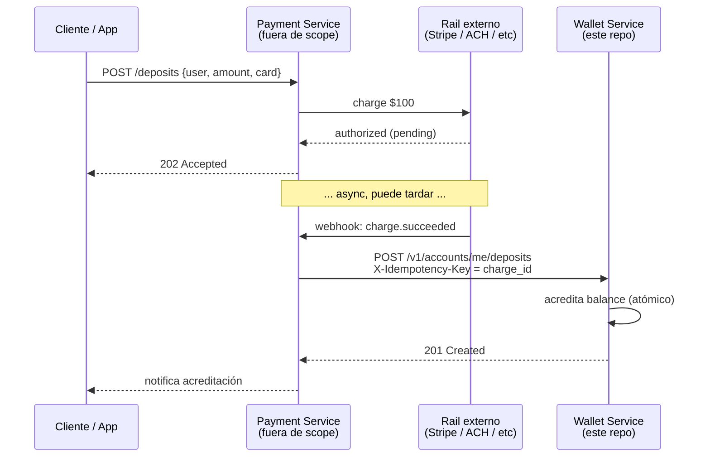
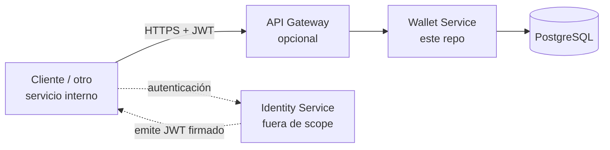
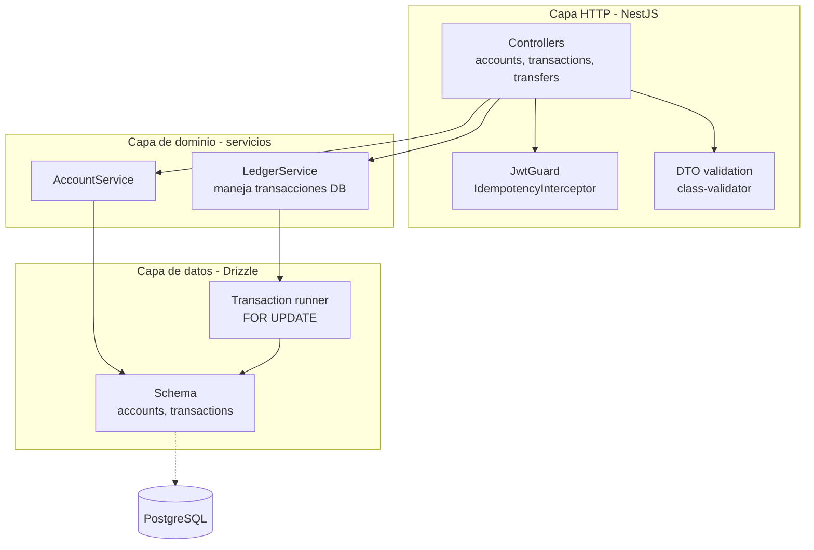

# Wallet Service - Documento de Diseño

> Este documento explica **qué construí, por qué, y qué decidí no resolver**.

---

## 1. Contexto y alcance

Construyo el servicio que es **la fuente de verdad del dinero** de la plataforma. Otros servicios (notificaciones, antifraude, cobros, BI) van a consumirlo. El negocio me pidió tres cosas explícitas y son la brújula del diseño entero:

1. No perder dinero ni crearlo de la nada.
2. No cobrar dos veces si el cliente reintenta.
3. Poder responder, en cualquier momento, por qué un usuario tiene el saldo que tiene.

A partir de eso, el sistema implementa cinco capacidades: crear cuenta, depositar, retirar, transferir, y consultar saldo + historial.

### Supuestos del entorno

- **Identidad y emisión de tokens viven fuera del servicio.** Asumo un Identity Service que autentica al usuario y emite un JWT firmado. El wallet service solo **valida** el token (firma + expiración) y extrae `user_id` del claim `sub`. No hay `/login`, `/signup`, ni manejo de passwords aquí: la identidad no es responsabilidad del wallet.
- **Existencia de un API Gateway** delante en producción (rate limiting, WAF, terminación TLS). El servicio de wallet no asume su presencia ya validam el JWT por sí mismo. Si el gateway existe, es mas defensa, y si no, el servicio sigue siendo seguro.
- **El `user_id` ya existe** cuando llega el `POST /accounts`. El wallet no crea usuarios, crea wallets asociados a un usuario que el IdP ya conoce.
- **Single-currency**, en este alcance. Documento al final cómo se extendería sin tirar el modelo.
- **El wallet no habla con rails externos** (Stripe, tarjetas, bancos). Es el ledger interno del dinero del producto, no el que realiza los cobros. Los `POST /deposits` y `POST /withdrawals` se invocan desde un Payment Service upstream que ya validó el movimiento externo. Más detalle en el documento mas adelante.

### 1.1 Frontera del servicio: por qué los depósitos se acreditan sincrónicamente

Un depósito "real" tiene dos partes: (a) cobrarle a la tarjeta o cuenta bancaria del usuario en un rail externo, que es asíncrono, puede fallar, puede tardar; (b) acreditar el saldo en el wallet. Estoy separando esas dos responsabilidades:

- **Payment Service (no lo construyo aquí):** se integra con rails externos. Maneja webhooks, retries, dead-letter queues, reconciliación contra el banco. Cuando el rail confirma que el dinero entró, llama al wallet sincrónicamente con un `X-Idempotency-Key` derivado del `charge_id` del rail.
- **Wallet Service (este codigo):** asume que el caller ya validó lo externo. Su único trabajo es mantener consistente el ledger interno. Por eso `POST /deposits` puede acreditar sincrónicamente sin queues ni retries, ya que esa complejidad vive donde corresponde.



**Para retiros la simetría se rompe un poco** y vale documentarla. La forma madura es un patrón en dos fases:

1. El wallet **debita** sincrónicamente (lo que sí implemento). El dinero del usuario "se va" del balance.
2. El Payment Service **ejecuta el payout** vía el rail. Si falla irrecuperablemente, llama al wallet para **revertir el débito** con una operación compensatoria (un depósito etiquetado como reverso, no un UPDATE - el ledger es append-only).

La forma realmente robusta requiere **holds / pending balance** (reservar antes de capturar). No lo implemento en este alcance, lo documento en sección 8. La defensa: el ledger ya soporta reversos por construcción (cualquier asiento se compensa con su inverso), así que la extensión no rompe el modelo.

> **Alternativa descartada: el wallet maneja directamente los rails externos.** Acoplaría el ledger a la disponibilidad de Stripe/banco/etc., introduciría queues y retry pools en el servicio que más estabilidad necesita, y mezclaría dos lógicas con frecuencias de cambio muy distintas. Es la primera línea de fractura que vería al escalar.

### Lo que el documento prioriza

Hay tres cosas en los que un servicio que mueve dinero se gana o se pierde: **concurrencia**, **idempotencia** y **atomicidad de operaciones compuestas**. Las secciones 4 y 5 (modelo de datos + garantías) son las largas a propósito - el resto se deriva de ahí.

---

## 2. Vista de sistema

### 2.1 Contexto



El cliente se autentica contra el IdP, obtiene un JWT, y lo usa para llamar al wallet. El wallet no se comunica con el IdP en runtime: confía en la firma del token (clave compartida o pública).

### 2.2 Componentes internos



Tres capas, sin abstracciones de más. No hay repositorios genéricos ni Use Cases por separado - para 5 capacidades, sumaría codigo boilerplate sin valor. Si el dominio crece, se introducen.

---

## 3. Modelo de datos

### 3.1 Esquema

```sql
-- Cuentas (cache de balance + ancla para locks)
CREATE TABLE accounts (
  id          UUID         PRIMARY KEY,           -- UUIDv4, generado en el servicio
  user_id     UUID         NOT NULL UNIQUE,       -- referencia externa al IdP
  balance     NUMERIC(20,4) NOT NULL DEFAULT 0,
  created_at  TIMESTAMPTZ  NOT NULL DEFAULT NOW(),
  CHECK (balance >= 0)
);

-- Ledger append-only (fuente de verdad del dinero)
CREATE TABLE transactions (
  id              UUID          PRIMARY KEY,        -- UUIDv7, ordenable temporalmente
  account_id      UUID          NOT NULL REFERENCES accounts(id),
  amount          NUMERIC(20,4) NOT NULL,           -- positivo o negativo, NUNCA cero
  type            TEXT          NOT NULL,           -- DEPOSIT | WITHDRAWAL | TRANSFER_OUT | TRANSFER_IN
  idempotency_key UUID          NULL,               -- ver índice parcial abajo
  transfer_id     UUID          NULL,               -- agrupa las 2 puntas de una transferencia
  created_at      TIMESTAMPTZ   NOT NULL DEFAULT NOW(),
  CHECK (amount <> 0),
  CHECK (type IN ('DEPOSIT','WITHDRAWAL','TRANSFER_OUT','TRANSFER_IN'))
);

-- Idempotencia: UNIQUE parcial (permite múltiples NULLs)
CREATE UNIQUE INDEX idx_transactions_idempotency_key
  ON transactions(idempotency_key)
  WHERE idempotency_key IS NOT NULL;

-- Paginación cursor sobre historial por cuenta
CREATE INDEX idx_transactions_account_created
  ON transactions(account_id, created_at DESC, id DESC);

-- Agrupar transferencias (lookup de las 2 puntas)
CREATE INDEX idx_transactions_transfer_id
  ON transactions(transfer_id)
  WHERE transfer_id IS NOT NULL;
```

### 3.2 Decisiones por campo

**`amount` como `NUMERIC(20,4)`**: los floats binarios (IEEE 754) acumulan error en operaciones decimales (`0.1 + 0.2 ≠ 0.3`). En un ledger eso rompe la invariante después de N operaciones sin que nadie haga nada mal. `NUMERIC` en Postgres es decimal exacto, precisión arbitraria. `(20,4)` me da hasta ~10 billones con 4 decimales - sobra para wallets fiat y deja margen para comisiones fraccionarias.

> **Alternativa descartada: `BIGINT` con la unidad mínima (centavos).** Es lo que hace Stripe internamente: más rápido, sin tema decimal. Lo descarté porque en este volumen no se nota la diferencia, y `NUMERIC` es más legible al hacer un `SELECT`. La extensión a entero es viable como migración futura si se justifica.

**`id` de `transactions` como UUIDv7**: se necesita ordenamiento temporal estable para paginación cursor (sección 6.3), y UUIDv7 codifica el timestamp en los primeros bits. Esto da tres cosas en uno: unicidad global, ordenable, opaco al cliente.

> **Alternativas descartadas:**
> - **`BIGSERIAL`:** ordenable y eficiente, pero filtra volumen al exterior (un `id=1234` puede revelar que existen 1234 transacciones) y crea contención en una sequence bajo carga alta.
> - **`UUIDv4`:** universalmente único pero no ordenable; en índices con binary tree genera inserts en posiciones aleatorias, peor cache locality y más fragmentación.

**`id` de `accounts` como UUIDv4** - no necesito ordenamiento sobre cuentas (no las pagino), prefiero el estándar más adoptado. `gen_random_uuid()` nativo de Postgres.

**`type` como `TEXT` con `CHECK`** en lugar de `ENUM` de Postgres - los enums de PG son rígidos para evolución (agregar valores requiere `ALTER TYPE`, no se pueden quitar). `TEXT + CHECK` da la misma garantía y se modifica con `DROP CONSTRAINT` + `ADD CONSTRAINT`. Trade-off mínimo en performance, ganancia grande en flexibilidad.

**`amount` puede ser positivo o negativo, nunca cero.** Convención: `DEPOSIT` y `TRANSFER_IN` son positivos; `WITHDRAWAL` y `TRANSFER_OUT` son negativos. Esto hace que la invariante sea simplemente `SUM(amount)` sin tener que interpretar el `type`. El `CHECK (amount <> 0)` previene tx vacías que ensuciarían el historial.

**Los reversos no son un tipo nuevo.** Cuando exista el Payment Service y necesite revertir un retiro fallido (ver §1.1), el asiento compensatorio se modela como un `DEPOSIT` con metadata de referencia al asiento original (idealmente una columna `reference_transaction_id` agregada en esa iteración), **no como un `WITHDRAWAL_REVERSAL`**. El ledger no necesita conocer la causa del asiento, solo el signo: para la invariante `SUM(amount)`, un reverso de retiro y un depósito común son indistinguibles, y eso es deseable. Agregar tipos por cada causa de negocio acopla el schema del ledger a la lógica del caller, que es justo lo que la separación con Payment Service busca evitar.

**`transfer_id` agrupa las dos puntas** - una transferencia genera dos filas en el ledger (débito en origen, crédito en destino, ver sección 5.3). `transfer_id` es el mismo en ambas y permite reconstruir la operación con un único `WHERE transfer_id = $X`. Es `NULL` para depósitos y retiros, donde no aplica.

### 3.3 La invariante

> Para toda cuenta `C`:  `accounts.balance(C) == SUM(transactions.amount WHERE account_id = C)`

El balance en `accounts` es **cache** del agregado del ledger. La fuente de verdad es el ledger. El cache existe por dos razones operacionales:
1. **Lectura O(1)** del saldo sin escanear N filas.
2. **Punto de serialización por cuenta** (la fila sobre la que aplica el lock pesimista).

La invariante no es un `CONSTRAINT` de Postgres - los `CHECK` no pueden cubrir agregaciones cross-tabla sin triggers caros. Se mantiene de dos formas complementarias:

- **Preservada transaccionalmente**: el `INSERT` en `transactions` y el `UPDATE` de `accounts.balance` ocurren dentro de la **misma transacción DB** con lock pesimista sobre la cuenta (sección 5). Atómico, no hay forma de que una se aplique sin la otra.
- **Verificable con reconciliación periódica**: un job (no implementado, ver sección 8) corre `SELECT account_id, SUM(amount) FROM transactions GROUP BY account_id` y compara contra `accounts.balance`. Si hay drift, alerta. Es el seguro de vida ante un bug que se nos pase a producción.

---

## 4. Contrato de API

### 4.1 Por qué REST + JSON

Es lo que mejor encaja con el consumidor probable (otros servicios internos + eventualmente clientes web/mobile) y con la naturaleza síncrona y request/response de las operaciones de wallet. Más fácil de debuggear, herramientas universales (curl, Postman), no requiere tooling adicional al cliente.

> **Alternativa descartada: gRPC.** Contratos tipados y mejor performance binaria, pero suma fricción (codegen, tooling) que no aporta valor mientras los consumidores no necesiten streaming ni baja latencia inter-servicio. Si el wallet pasara a ser hot path de un sistema de pagos, sería la conversación.
>
> **Alternativa descartada: eventos / async.** Las operaciones de wallet requieren respuesta inmediata al cliente ("¿se acreditó o no?"). Asincronía abajo (publicar eventos a otros servicios) es válida y la cubro en la sección 8 con outbox pattern, pero el contrato externo es síncrono.

### 4.2 Endpoints

| Método | Path | Propósito | Idempotente |
|--------|------|-----------|-------------|
| `POST` | `/v1/accounts` | Crear wallet para el `user_id` del JWT | Natural (UNIQUE en `user_id`) |
| `GET`  | `/v1/accounts/me` | Saldo actual del caller | Sí (lectura) |
| `GET`  | `/v1/accounts/me/transactions?cursor=&limit=` | Historial paginado | Sí (lectura) |
| `POST` | `/v1/accounts/me/deposits` | Acreditar saldo | Vía `X-Idempotency-Key` |
| `POST` | `/v1/accounts/me/withdrawals` | Debitar saldo | Vía `X-Idempotency-Key` |
| `POST` | `/v1/transfers` | Mover saldo entre cuentas | Vía `X-Idempotency-Key` |
| `GET`  | `/v1/health` | Liveness + readiness (DB ping) | Sí |

**Notas de diseño:**

- **`/me` en lugar de `/{account_id}` para el dueño.** El JWT ya identifica al caller; no expongo IDs en la URL para operaciones del propio usuario. Esto evita IDOR (Insecure Direct Object Reference) por descuido. `POST /transfers` sí toma `destination_account_id` en el body porque es necesario.
- **Versioning en URL (`/v1/`).** Visible, cacheable, no obliga al cliente a manejar header de negociación. Convención común para APIs internas. Alternativa descartada: header `Accept-Version`, más limpio en teoría pero menos manejable en práctica (no se ve en logs/tracing sin extraerlo).
- **Recursos plurales, verbos como sub-recursos** (`/accounts/me/deposits` en vez de `/accounts/me/deposit`). REST estricto pediría representar "depósitos" como recursos creables, lo cual coincide con la realidad: un depósito es una transacción que persiste y se puede consultar.

### 4.3 Idempotencia

**Convención de protocolo:** todas las operaciones de escritura aceptan el header `X-Idempotency-Key: <UUIDv4>`. El cliente lo genera, es responsable de reutilizarlo en reintentos.

**Implementación:**

1. El handler intenta el `INSERT` con el `idempotency_key`.
2. Si Postgres rechaza con `23505` (violación de UNIQUE), capturo el error.
3. Busco la transacción existente: `SELECT * FROM transactions WHERE idempotency_key = $key`.
4. **Comparo los campos del request actual contra los de la tx guardada** (account, amount, type, destination si aplica).
   - Match → 200 OK con el body equivalente al original. Replay legítimo.
   - Mismatch → **409 Conflict** con código `IDEMPOTENCY_KEY_REUSED`. El cliente tiene un bug (reusó un key para otra operación).
5. Si no se pasa el header → **400 Bad Request**. Header obligatorio para escrituras.

**Por qué no una tabla `idempotency_records` separada (estilo Stripe):** evita tabla extra y replicación del response body. El response es determinístico a partir de la tx (id, amount, balance resultante, timestamps) y se reconstruye leyendo por `idempotency_key`. Acepta el trade-off de no guardar el response byte-exacto: si en el futuro las representaciones evolucionan, un replay viejo podría recibir un body ligeramente distinto al original. Lo considero aceptable.

**Por qué el key vive en `transactions` (sección 3) con UNIQUE parcial:** evita una tabla nueva y un round-trip extra. Pago el costo del índice parcial (mínimo en Postgres). Para transferencias, el key vive solo en la fila `TRANSFER_OUT` - la fila `TRANSFER_IN` tiene `NULL` (ver 5.3 para el porqué).

### 4.4 Errores

Formato uniforme tipo Problem Details (RFC 7807) simplificado:

```json
{
  "error": {
    "code": "INSUFFICIENT_FUNDS",
    "message": "Account balance is lower than requested withdrawal amount",
    "details": { "account_id": "...", "balance": "100.0000", "requested": "150.0000" },
    "request_id": "01HXY..."
  }
}
```

**Tabla de errores principales:**

| HTTP | Code | Cuándo |
|------|------|--------|
| 400  | `VALIDATION_ERROR` | DTO inválido, header faltante |
| 401  | `UNAUTHENTICATED` | JWT inválido/expirado/ausente |
| 403  | `FORBIDDEN` | JWT válido pero operando sobre recursos ajenos |
| 404  | `ACCOUNT_NOT_FOUND` | Cuenta destino de transfer no existe |
| 409  | `ACCOUNT_ALREADY_EXISTS` | El user ya tiene cuenta |
| 409  | `IDEMPOTENCY_KEY_REUSED` | Mismo key, payload distinto |
| 422  | `INSUFFICIENT_FUNDS` | Validación de negocio falla |
| 422  | `INVALID_AMOUNT` | amount ≤ 0 o exceso de decimales |
| 422  | `SELF_TRANSFER` | origen == destino en transfer |
| 500  | `INTERNAL_ERROR` | Bug inesperado |
| 503  | `SERVICE_UNAVAILABLE` | DB caída, deadlock no recuperado, etc. |

**Cómo distingo 422 vs 409:** 422 es "el request es válido sintácticamente pero rompe una regla de negocio sobre los datos actuales". 409 es "el request choca con el estado del recurso de forma irreconciliable". Útil para que el cliente decida si reintentar (409: no, ajustar; 422: probablemente no, salvo cambio de contexto).

### 4.5 Paginación del historial

**Cursor-based**, no offset-based. El ledger es append-only y puede crecer indefinidamente; offset sería ineficiente (escanear N filas para descartarlas) e inconsistente bajo inserts concurrentes.

**Formato del cursor:** opaco para el cliente, internamente `base64url({ ts, id })` donde `ts` es `created_at` y `id` es el UUIDv7 de la última fila de la página anterior.

**Query:**
```sql
SELECT * FROM transactions
WHERE account_id = $caller
  AND (created_at, id) < ($cursor_ts, $cursor_id)
ORDER BY created_at DESC, id DESC
LIMIT $limit;
```

El desempate por `id` cubre el caso de dos transacciones con el mismo `created_at` (mismo milisegundo). Postgres soporta comparación de tuplas lexicográficamente. El `id` siendo UUIDv7 también es cronológicamente coherente como desempate.

Response incluye `next_cursor` (null si no hay más) y `items`.

---

## 5. Garantías

> Esta sección es el corazón del documento. Lo que sigue describe **qué le prometo al consumidor** cuando las cosas se complican.

### 5.1 Concurrencia: protección contra saldos negativos y dobles débitos

**Promesa:** dos requests sobre la misma cuenta nunca pueden leer el mismo balance "viejo" y validar ambos contra él.

**Mecanismo: locking pesimista por fila.**

Toda operación de escritura abre una transacción DB y, antes de leer el balance, hace:

```sql
SELECT id, balance FROM accounts
WHERE id = $account_id
FOR UPDATE;
```

`FOR UPDATE` adquiere un lock exclusivo sobre la fila. Cualquier otra transacción que intente `FOR UPDATE` la misma fila **espera en cola** hasta que la primera commitee o haga rollback. Lecturas sin lock (`SELECT` simple) siguen viendo el valor anterior y no se bloquean - lo cual es correcto: la consulta de saldo no necesita serialización.

**Nivel de aislamiento:** `READ COMMITTED` (default de Postgres). No necesito `SERIALIZABLE` porque el lock pesimista ya me da serialización efectiva por cuenta, sin pagar el costo de retries por `serialization_failure`.

> **Alternativa descartada: optimistic locking con columna `version`.** Funciona en escenarios de baja contención sobre la misma cuenta; bajo alta contención (muchos writes a la misma cuenta) genera reintentos masivos y throughput impredecible. Pesimista es más simple y predecible para wallets. El costo de pesimista es throughput por cuenta caliente, no por sistema.

### 5.2 Deadlocks en transferencias

**El problema:** una transferencia bloquea dos filas (origen y destino). Si dos transferencias inversas llegan simultáneas (`A→B` y `B→A`), cada una puede adquirir un lock y esperar el otro → ciclo → deadlock.

**Mecanismo: orden determinístico de adquisición de locks.**

Antes de hacer los `SELECT ... FOR UPDATE`, ordeno los `account_id` involucrados. El query queda:

```sql
SELECT id, balance FROM accounts
WHERE id IN ($A, $B)
ORDER BY id
FOR UPDATE;
```

El `ORDER BY id` fuerza a Postgres a adquirir los locks en orden alfabético del UUID, sin importar cuál sea origen o destino. Así, `A→B` y `B→A` bloquean ambas primero el de menor UUID, segundo el de mayor. **No hay ciclo**, no hay deadlock, solo cola limpia.

Postgres tiene un deadlock detector como red de seguridad (~1s), pero el objetivo es no activarlo. Si por algún camino se nos escapa un deadlock, Postgres aborta una transacción con `40P01`, Drizzle propaga la excepción, hacemos rollback y el cliente recibe **503**. No hay corrupción de datos posible: rollback es atómico.

> **Alternativa descartada: serializar transferencias con un lock global (advisory lock o mutex en app).** Mata el throughput. El orden determinístico cuesta una línea de código y resuelve el caso real.

### 5.3 Atomicidad de la transferencia

**El problema:** una transferencia son 4 cambios en DB (2 inserts en `transactions` + 2 updates en `accounts`). Si solo se aplican algunos, perdemos o creamos dinero.

**Mecanismo: una sola transacción DB envuelve los 4 cambios.**

```
BEGIN;
  SELECT id, balance FROM accounts WHERE id IN ($A, $B) ORDER BY id FOR UPDATE;
  -- validación en código: balance($A) >= $amount
  INSERT INTO transactions (..., account_id=$A, amount=-$X, type='TRANSFER_OUT',
                            idempotency_key=$key, transfer_id=$tid);
  INSERT INTO transactions (..., account_id=$B, amount=+$X, type='TRANSFER_IN',
                            idempotency_key=NULL, transfer_id=$tid);
  UPDATE accounts SET balance = balance - $X WHERE id = $A;
  UPDATE accounts SET balance = balance + $X WHERE id = $B;
COMMIT;
```

**Garantías que esto da:**
- Si cualquier paso falla (excepción, constraint, deadlock), Drizzle hace ROLLBACK automático al salir del bloque `db.transaction()`. **Cero cambios aplicados.**
- Si el proceso se muere entre los pasos pero antes del COMMIT, Postgres detecta el cliente desconectado y hace rollback server-side. **Cero estado parcial visible.**
- Si COMMIT termina, los 4 cambios están durables en disco (WAL fsync). **Operación completa.**

**Por qué la `idempotency_key` solo en la fila `TRANSFER_OUT`:** el UNIQUE parcial sobre `idempotency_key` rechazaría duplicados dentro de la misma operación si lo pusiera en ambas filas. Convención: el key vive en el lado del sender (que es quien firma la intención). Para lookup en retry: `SELECT * FROM transactions WHERE idempotency_key = $key` me devuelve el `TRANSFER_OUT`; con su `transfer_id` traigo la fila `TRANSFER_IN` si necesito reconstruir el response completo.

### 5.4 Idempotencia bajo retry

**El problema:** el cliente envía un depósito, no recibe respuesta (timeout de red), reintenta. No debe duplicar el cargo.

**Mecanismo:** ya descrito en 4.3. Resumen del flujo en condiciones de carrera:

```mermaid
sequenceDiagram
    participant Cliente
    participant Wallet
    participant DB

    Cliente->>Wallet: POST /deposits + key=K, amount=100
    Wallet->>DB: BEGIN; INSERT tx(key=K, +100); COMMIT
    DB-->>Wallet: OK
    Wallet--xCliente: response (perdido en la red)

    Note over Cliente,Wallet: Cliente reintenta con el mismo K

    Cliente->>Wallet: POST /deposits + key=K, amount=100
    Wallet->>DB: BEGIN; INSERT tx(key=K, +100)
    DB-->>Wallet: ERROR 23505 (UNIQUE violation)
    Wallet->>DB: ROLLBACK; SELECT * WHERE key=K
    DB-->>Wallet: tx existente
    Wallet->>Wallet: compare payload vs tx
    Wallet-->>Cliente: 200 OK con tx existente
```

**Race entre dos requests simultáneos con el mismo key:** el segundo `INSERT` espera al primero (los UNIQUE indexes en Postgres adquieren lock implícito durante el insert). Cuando el primero commitea, el segundo recibe `23505`. El handler hace lo mismo: lookup + comparación + 200 o 409.

### 5.5 Fallo del proceso a mitad de operación

**Promesa:** ningún cliente queda en un estado donde su dinero "se quedó a medias".

**Mecanismo:** todo movimiento de dinero está dentro de una única transacción DB. El proceso del wallet es **stateless** entre requests (no hay estado en memoria que sobreviva al request). Si el proceso muere:

- Antes del COMMIT → Postgres rollback server-side. El cliente recibe error de conexión (5xx), reintenta con el mismo `idempotency_key`, y como nada se persistió, la operación se ejecuta limpiamente.
- Después del COMMIT pero antes de devolver respuesta al cliente → la operación quedó aplicada, el cliente reintenta, idempotencia devuelve 200 con la tx existente. Convergente.

Lo único que **no** está cubierto: si el proceso muere después del COMMIT y el cliente **no** reintenta (por ejemplo, porque también murió), el cliente nunca sabrá que su operación fue exitosa. Ese problema no se puede resolver desde el servidor - es el problema de los dos generales. La idempotencia lo mitiga: cualquier consumidor que reintente convergerá al estado correcto.

### 5.6 Fallo momentáneo de DB

**Promesa:** errores transitorios no producen estado corrupto, solo errores 5xx.

Si la DB cae a mitad de una transacción, la conexión se rompe, la transacción se aborta server-side (o si no se commiteó, nunca quedó). El cliente recibe 503. **No hay caso de "se aplicó la mitad"** por el contrato ACID.

Lo que **no** implemento: pool de fallover, lectura desde réplicas, circuit breaker. Para producción real, sí. Para este alcance, fuera.

---

## 6. Estrategia de testing

> No persigo cobertura ciega. Cada test que escribo cubre un riesgo concreto que identifiqué en la sección 5. Si un test no se justifica con "esto previene tal escenario malo", no lo escribo.

### 6.1 Tests críticos de integración (los que cuentan la historia)

**T1 - Race condition en retiros: no se permite saldo negativo.**

- Setup: cuenta con balance 100.
- Acción: `Promise.all` con 10 retiros simultáneos de 50 cada uno.
- Aserción: exactamente 2 retiros tienen éxito (200), 8 fallan con `INSUFFICIENT_FUNDS` (422). Balance final = 0. `SUM(transactions)` = 0.
- Riesgo cubierto: race condition por lectura concurrente del balance. Si el lock pesimista no funcionara, varios verían 100 y aprobarían.

**T2 - Idempotencia: mismo key, mismo payload → un solo efecto.**

- Setup: cuenta con balance 0.
- Acción: 5 depósitos en paralelo con el mismo `X-Idempotency-Key` y `amount=100`.
- Aserción: 5 respuestas 200 OK con la misma `transaction_id`. Balance final = 100, no 500. Una sola fila en `transactions`.
- Riesgo cubierto: cliente retry agresivo, doble cobro.

**T3 - Idempotencia con payload distinto: 409.**

- Setup: depósito previo con key K y amount 100, exitoso.
- Acción: segundo request con key K pero amount 200.
- Aserción: 409 `IDEMPOTENCY_KEY_REUSED`. Balance sigue en 100. Una sola fila.
- Riesgo cubierto: bug del cliente reusando keys; detecta y notifica en vez de hacer algo silenciosamente raro.

**T4 - Transferencia atómica: rollback completo en fallo.**

- Setup: cuenta A con 100, cuenta B con 0.
- Acción: transferencia A→B inyectando una excepción después del débito (mock que falla en el insert del `TRANSFER_IN`).
- Aserción: A queda con 100 (no 0), B con 0. Cero filas nuevas en `transactions`.
- Riesgo cubierto: atomicidad de operación compuesta. Demuestra que la transacción DB envuelve todo.

**T5 - Deadlocks en transferencias inversas: no se cuelgan ni corrompen.**

- Setup: A y B con balance suficiente para transferencias cruzadas.
- Acción: `Promise.all` con N transferencias A→B y N transferencias B→A simultáneas, montos iguales.
- Aserción: todas terminan (ninguna se cuelga indefinidamente), balance final de A y B = balances iniciales (los movimientos se cancelan), invariante `balance == SUM(tx)` se cumple en ambas cuentas.
- Riesgo cubierto: el orden determinístico de locks funciona. Si fallara, el deadlock detector marcaría algunos requests con 503; el test verifica throughput limpio.

**T6 - Invariante del ledger: property-based ligero.**

- Setup: 5 cuentas con balances iniciales aleatorios.
- Acción: 200 operaciones aleatorias (mix de depósitos, retiros, transferencias) en paralelo.
- Aserción: para cada cuenta, `accounts.balance == SUM(transactions.amount WHERE account_id = X)`.
- Riesgo cubierto: la invariante fundamental se sostiene bajo carga mixta concurrente. Si algo se nos pasa en cualquier código path, este test lo cacha.

### 6.2 Tests unitarios (más livianos)

- Validación de DTOs (montos negativos, decimales excesivos, UUIDs inválidos).
- Cálculo de cursor y decoding.
- Mapeo de errores Postgres → códigos HTTP.

No los enumero uno por uno: son los obvios. Los críticos son los de arriba.

### 6.3 Lo que NO se testea (consciente)

- Performance / load testing. Fuera de scope.
- Tests E2E contra el servicio dockerizado real. Los de integración apuntan a una Postgres real (testcontainers), suficiente para los riesgos.
- Validación de JWT contra un IdP real. Stub firmado con la clave del `.env`.

---

## 7. Operación

### 7.1 Cómo se levanta

```bash
cp .env.example .env
docker compose up --build
```

Eso levanta: Postgres (con volumen persistente), corre migraciones (Drizzle Kit), y arranca el servicio. Tests:

```bash
docker compose run --rm app npm test
```

### 7.2 Health check

`GET /v1/health` devuelve:

```json
{ "status": "ok", "checks": { "db": "ok" } }
```

Verifica conexión a Postgres con `SELECT 1`. Si la DB no responde, devuelve 503 con `db: "fail"`. Apto para liveness + readiness de Kubernetes.

### 7.3 Logging

Structured JSON logs (`pino`), un log por request con: `request_id`, `user_id`, `method`, `path`, `status`, `latency_ms`, `error_code` (si aplica). El `request_id` viene del header `X-Request-Id` si está, o se genera (UUIDv7) si no, y se propaga a cualquier log dentro del request.

**Lo que se loguea con nivel `warn` y dispara alerta** (en producción real):
- Cualquier 5xx.
- Deadlock detectado (`40P01`).
- Reuse de `idempotency_key` con payload distinto (señal de bug en cliente).

**Lo que NO se loguea:** payloads que contengan montos arriba de un threshold (PII financiera), JWTs completos, claims sensibles. Solo `user_id`.

### 7.4 Métricas (mínimo viable)

No implementado en este alcance, pero documento qué expondría:

- `wallet_requests_total{endpoint, status}` - counter.
- `wallet_request_duration_seconds{endpoint}` - histogram.
- `wallet_db_transaction_duration_seconds{operation}` - histogram (deposit, withdrawal, transfer).
- `wallet_idempotency_replays_total` - counter (cuántos retries idempotentes hubo).
- `wallet_deadlocks_total` - counter (debería ser ~0).
- `wallet_balance_invariant_drift_total` - counter (debería ser 0; lo emite el job de reconciliación cuando se implemente).

### 7.5 Cómo se debuggea un incidente

"Un usuario reclama que su saldo está mal":

1. Buscar al usuario por `user_id` en `accounts`. Obtener `balance` cacheado.
2. `SELECT SUM(amount) FROM transactions WHERE account_id = $X`.
3. Si difieren → invariante rota, incidente grave. Ir al ledger, leer cronológicamente, encontrar la operación que dejó drift. Usar `request_id` de la fila de la tx (sería bueno agregarlo al schema en una iteración) para encontrar el log.
4. Si coinciden → el saldo es matemáticamente correcto. Revisar historial con el cliente, probablemente el problema es de percepción/UX.

---

## 8. Lo que dejé fuera (y por qué / cómo lo agregaría)

**Multi-currency.** Hoy todo es una moneda implícita. Para agregar: tabla `account_balances(account_id, currency, balance)` con PK compuesta; `transactions` gana columna `currency`. La cuenta deja de tener `balance` directo, se consulta el balance por moneda. Migración: `ADD COLUMN ... NULL` + backfill en batches + `NOT NULL VALIDATE` para evitar locks pesados.

**Eventos a otros servicios (outbox pattern).** Hoy las operaciones no publican nada. Cuando notificaciones/antifraude/BI lo pidan: tabla `outbox(id, event_type, payload, published_at)`, poblada en la misma transacción DB que la tx (atómico), + un worker publisher que la lee y publica a Kafka/RabbitMQ, marcando `published_at`. Consumidores deben ser idempotentes (garantía at-least-once).

**Reconciliación automática.** El job descrito en 3.3 no está implementado. Sería un cron diario que corre la query de invariante por todas las cuentas y emite la métrica `wallet_balance_invariant_drift_total`. Alertable a `> 0`.

**Archiving del ledger.** El ledger crece para siempre. En producción real, particionar `transactions` por `created_at` (mensual) y archivar particiones viejas a almacenamiento más barato. Hoy una sola tabla; las queries y los índices están pensados para que el particionado no rompa nada.

**Soft delete / congelamiento de cuentas.** No hay flag `frozen` ni `closed_at`. Para agregar: columna nullable, controllers verifican antes de operar. No afecta el ledger (las cuentas congeladas igual conservan su historial).

**Rate limiting.** Asumo que el API Gateway lo hace. Si no hay gateway, agregar a nivel servicio con `@nestjs/throttler` o similar. No es prioridad mientras el contrato sea servicio-a-servicio.

**Tracing distribuido.** OpenTelemetry SDK + exportador OTLP, propagación de `traceparent`. Útil cuando el wallet sea parte de un flujo más grande (pagos, checkout). Hoy con `request_id` correlacionable en logs alcanza.

**Métricas avanzadas + dashboards.** Prometheus + Grafana en producción. El esqueleto de qué exponer ya está en 7.4.

**Endpoint de login / signup.** Identidad vive fuera. El repo incluye `scripts/generate-token.ts` para emitir JWTs firmados con la clave del `.env`, equivalente a lo que haría el IdP. Para demo y tests.

**Cuentas múltiples por usuario.** Hoy `UNIQUE(user_id)` en `accounts` fuerza una cuenta por usuario. Si en el futuro se necesitan wallets etiquetados (ej. "ahorros" y "gastos"), quitar el UNIQUE y agregar columna `label` con `UNIQUE(user_id, label)`.

**OAuth / refresh tokens.** El JWT actual es simple bearer. Producción real probablemente quiera OAuth2 + refresh, pero eso pertenece al IdP, no al wallet.

**Holds / pending balance para retiros.** Hoy el débito de retiro es inmediato y definitivo; si el Payment Service upstream falla al ejecutar el payout, debe llamar de vuelta al wallet para registrar un reverso (depósito compensatorio). La forma madura es agregar una fase de "hold": el wallet reserva el monto (lo mueve a `pending_balance` o crea una fila `HOLD`), el Payment Service ejecuta, y luego el wallet **captura** (convierte a `WITHDRAWAL` definitivo) o **libera** (revierte la reserva). Cambios necesarios: estados de transacción + dos endpoints (`/holds/:id/capture`, `/holds/:id/release`) + un balance "disponible" derivado de `balance - holds_activos`. El ledger no cambia conceptualmente, solo gana más tipos de fila.

**Estados de transacción (`PENDING`/`COMPLETED`/`REVERSED`).** Atado al punto anterior. Hoy toda fila en `transactions` se considera `COMPLETED` por construcción (solo se inserta cuando la operación se commitea). Para soportar holds o pagos en vuelo, agregaría columna `status` con default `COMPLETED`. Migración no rompe nada porque las filas existentes ya cumplen el invariante.

**Webhooks / notificaciones a clientes.** El wallet no notifica activamente a nadie hoy. En producción, después del COMMIT de un movimiento se emitiría un evento (vía outbox, ver más arriba) que otros servicios (notificaciones push, email, antifraude) consumirían. El wallet no debe hacer la llamada HTTP saliente él mismo - eso lo mete en problemas de retry y de latencia.

---

## 9. Trade-offs principales (resumen ejecutivo)

| Decisión | Lo que gano | Lo que pago |
|----------|-------------|-------------|
| Postgres + ACID + locks pesimistas | Garantías fuertes con código simple | Throughput limitado por cuenta caliente |
| `NUMERIC` en vez de `BIGINT` centavos | Legibilidad en debugging | Marginalmente más lento aritméticamente |
| UUIDv7 en `transactions` | Ordenamiento temporal + opacidad + buen comportamiento en índices | Dependencia de librería externa |
| Idempotencia en la columna (no tabla aparte) | Una tabla menos, una abstracción menos | No replico response byte-exacto |
| Cache de balance en `accounts` + ledger fuente de verdad | Lectura O(1) + punto único de lock | Redundancia que requiere reconciliación |
| REST sobre gRPC | Simplicidad + debugging | Sin contratos tipados fuertes |
| Lock pesimista sobre optimista | Throughput predecible | Throughput menor en alta contención |
| `READ COMMITTED` + `FOR UPDATE` | Sin retries por `serialization_failure` | Lock pesimista explícito en código |
| Sin endpoint de login | Separación correcta de responsabilidades | Setup extra para el reviewer (script de tokens) |

---

## 10. Lo que estoy más nervioso de defender

Por honestidad, si me preguntan en la sesión, estos son los puntos donde más tendría que pararme firme:

- **No implementé reconciliación.** Es la red de seguridad de la invariante. Está documentada pero no codeada. Mi defensa: el alcance no la pedía, las invariantes están preservadas transaccionalmente, y el job es ~20 líneas que agregaría en la siguiente iteración.
- **No replico response body en idempotencia.** Stripe sí lo hace. Mi defensa: para este contrato los responses son determinísticos a partir de la tx; el costo de una tabla extra no se justifica al volumen actual.
- **Cuello de botella por cuenta caliente con lock pesimista.** Es real, pero las cuentas calientes en wallets de usuario individual no son comunes. Si el caso fuera "cuenta de tesorería del sistema con 1000 escrituras por segundo", repensaría con event sourcing o partición lógica del balance.
- **No hay tests de seguridad explícitos** (auth bypass, IDOR). Confío en `JwtGuard` y en que las rutas usan `/me` derivado del token. Para producción, agregaría tests específicos.
- **No modelo el ciclo de vida real de un depósito o retiro contra rails externos.** Asumo un Payment Service upstream que ya validó el movimiento externo y llama al wallet con un key idempotente derivado del `charge_id`. Es una simplificación consciente, no un olvido. La defensa: poner queues, webhooks o retry pools en el wallet acoplaría el ledger a la disponibilidad de Stripe/banco/etc., que es exactamente lo que no quiero. Sección 1.1 explica la frontera; sección 8 cubre cómo se agregarían holds y reversos sin romper el modelo.
